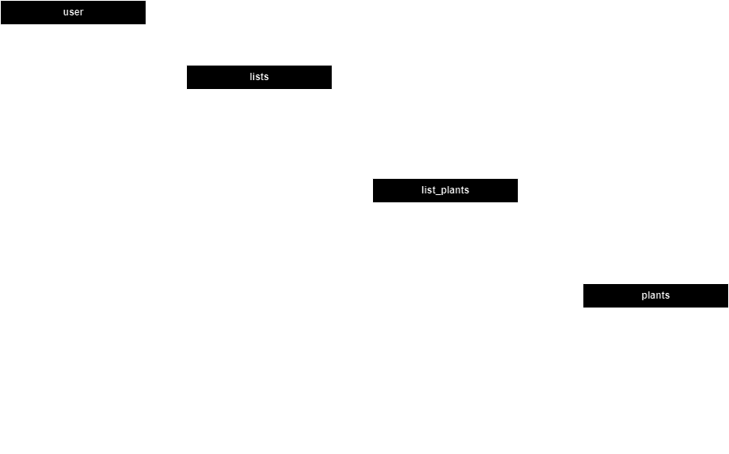

# Plant Planner

Capstone 2 Project

Plant Planner is designed to become the green thumb's best companion. It is a user-friendly web application aimed at helping plant lovers manage their indoor and outdoor plant collections with ease.

The project was deployed on Render and is live at https://plant-planner.onrender.com/ 

## Tech Stack

For this project, I will be harnessing the power of the following technologies:

- **Front-End**: React, an efficient and flexible JavaScript library for building UI interfaces.
- **Back-End**: Node and Express, providing a lightweight and flexible framework for server-side development.
- **Database**: PostgreSQL, offering robust data management and reliable performance.

## Project Focus

The project will take a full-stack approach with an equal focus on both front-end and back-end. While the back-end ensures a strong, reliable foundation, the front-end will be designed to deliver an interactive, user-friendly experience.

## Project Type

The project will be designed as a website to provide easy access for users on desktops to start out.

## Project Goal

The main goal of this project is to create a planner that allows users to manage and track their diverse plant collections. Each user will have the ability to create multiple lists, each one dedicated to a different category of plants.

## User Types

Plant Planner is intended for everyone, from beginner plant enthusiasts to seasoned gardeners. Anyone interested in keeping their plants healthy and thriving, whether they're growing a home jungle or cultivating a backyard garden, can benefit from using this app.

## Data Used

To provide users with extensive information about a variety of plants, I'll be utilizing data from the Perenual Plant API, found at https://perenual.com/docs/api. This API delivers a wealth of information such as required sun time, optimal watering schedule, the best climate for growth, and much more for thousands of different plants.

## Project Outline 

### Database Scema

### API Issues

The chosen API presents some potential challenges, including rate limits and access restrictions to certain plant data. As the project progresses, I will explore ways to work within these limitations to deliver a seamless experience to users.

### Sensitive Information

Securing user data is a top priority for this project. The sensitive information includes usernames and passwords, which will be securely stored and handled according to best practices for user data security.

### Project Functionality

This project will include the following key functionalities:

1. **User Account Creation and Authentication**: Users can create an account and log in to personalize and save their lists. 
2. **Plant Database Interaction**: The app will access an API that provides information about a variety of plants. This information can include plant care guidelines, growth conditions, and more.
3. **List Creation and Management**: Users can create and manage multiple lists of plants. These could be for different purposes (garden crops, indoor plants, etc.). 
4. **Individual Plant Management**: Within each list, users can add individual plants, assign care tasks, and record dates of key events (like planting, fertilizing, etc.).
5. **Task Scheduling and Reminders**: The app will allow users to set tasks related to their plants and send reminders when tasks are due.
6. **Tips and Guides**: The app will have a section where users can read and learn more about plant care based on the types of plants they have.

### User Flow

1. **Sign Up/Log In**: User creates a new account or logs into an existing account.
2. **Dashboard View**: User sees their existing plant lists or creates a new one.
3. **List Creation/Management**: User adds plants to a list from the plant database. They can name the list, set the type (garden, indoor, etc.), and add notes about the overall list.
4. **Plant Management**: Within a list, the user can click on a plant to see its details and manage plant-specific tasks.
5. **Task Management**: User can create tasks for a plant and set reminders.
6. **Learning Center**: User visits the Tips and Guides section to learn more about plant care.

### CRUD and Beyond

While this project certainly includes CRUD (Create, Read, Update, Delete) functionality (creating lists, reading plant data, updating tasks, and deleting plants/lists), it also offers a more comprehensive user experience.

The integration with the plant API adds a layer of complexity and usefulness, as it provides data that the user doesn't have to input manually. The task scheduling and reminder system makes the app more interactive, and the educational content makes it more engaging and helpful.

For stretch goals, consider the following:

1. **Social Sharing**: Users can share their plant lists or individual plants on social media or directly with friends who also use the app.
2. **Gamification**: Users earn points or badges for completing tasks, maintaining plants, or learning through the Tips and Guides section.
3. **Plant Identification**: Integrate with a plant identification API to let users identify unknown plants.
4. **Weather and Climate Adaptation**: The app could suggest when to water or adjust care based on local weather data.
5. **Marketplace**: A platform where users could exchange, sell, or buy plants or seeds.

